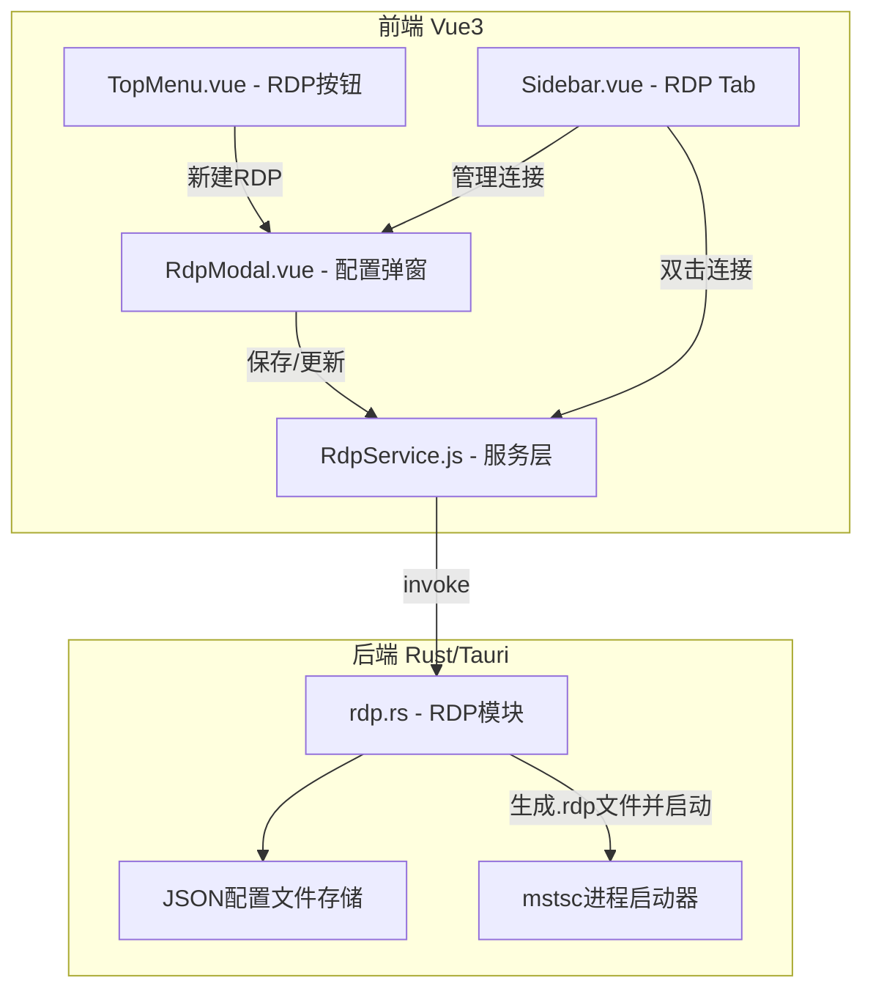
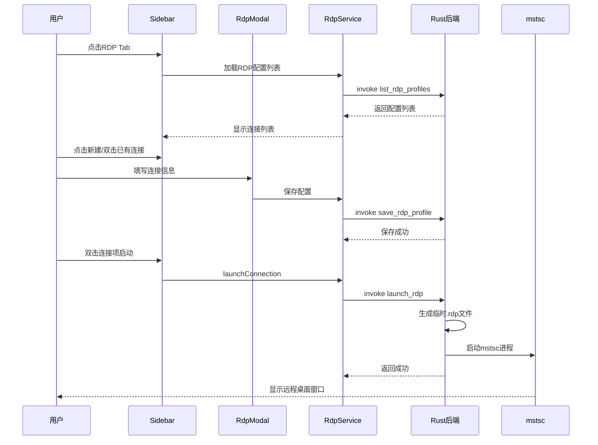

# 远程桌面管理功能实施计划

## 1. 功能概述

新增远程桌面（RDP）管理功能，作为 Termlink 的一个独立连接类型。用户可以在界面中配置、管理远程桌面连接，点击连接后调用系统自带的 `mstsc` 客户端建立 RDP 会话。

**核心原则**：仅作为管理入口，不替代 mstsc 本身功能，复用系统已保存的凭据。

---

## 2. 架构设计

### 2.1 整体架构



### 2.2 数据模型

```rust
// RDP 配置文件结构
pub struct RdpProfileMeta {
    pub id: String,           // 唯一标识
    pub host: String,         // 目标主机地址
    pub port: u16,            // RDP端口，默认3389
    pub username: Option<String>,  // 用户名（可选，预填充）
    pub domain: Option<String>,    // 域名（可选）
    pub name: Option<String>,      // 显示名称
    pub group: Option<String>,     // 分组名称
    pub tags: Vec<String>,         // 标签列表
    pub fullscreen: bool,          // 是否全屏
    pub width: Option<u32>,        // 窗口宽度
    pub height: Option<u32>,       // 窗口高度
    pub admin_mode: bool,          // 管理模式 /admin
    pub console_session: bool,     // 控制台会话
}
```

### 2.3 mstsc 调用策略

采用 **生成临时 .rdp 文件 + 启动 mstsc** 的方式：

```
1. 根据配置生成临时 .rdp 文件到 %TEMP%/termlink_rdp_{id}.rdp
2. 执行命令: mstsc <temp_file>.rdp
3. mstsc 启动后，用户在系统原生界面输入凭据
```

.rdp 文件关键配置项：
- `full address:s:host:port` - 连接地址
- `username:s:domain\user` - 预填充用户名
- `screen mode id:i:2` - 全屏=2，窗口=1
- `desktopwidth:i:1920` / `desktopheight:i:1080` - 分辨率
- `session bpp:i:32` - 色深
- `administrative session:i:1` - 管理模式

---

## 3. 文件变更清单

### 3.1 新增文件

| 文件路径 | 说明 |
|---------|------|
| `src-tauri/src/rdp.rs` | Rust 后端 RDP 模块 |
| `src/services/RdpService.js` | 前端 RDP 服务层 |
| `src/components/RdpModal.vue` | RDP 连接配置弹窗 |

### 3.2 修改文件

| 文件路径 | 变更内容 |
|---------|---------|
| `src-tauri/src/lib.rs` | 注册 RDP 相关命令 |
| `src/components/Sidebar.vue` | 新增 RDP 连接管理 Tab |
| `src/components/TopMenu.vue` | 新增 RDP 快捷按钮 |
| `src/App.vue` | 集成 RDP 功能到主应用 |

---

## 4. 详细实施步骤

### 步骤 1：后端 - 创建 `src-tauri/src/rdp.rs`

实现以下 Tauri 命令：

- **`save_rdp_profile`** - 保存 RDP 配置到 JSON 文件（复用 `profiles_dir` 模式，存放在 `rdp_profiles/` 子目录）
- **`list_rdp_profiles`** - 列出所有已保存的 RDP 配置
- **`delete_rdp_profile`** - 删除指定 RDP 配置
- **`launch_rdp`** - 生成临时 .rdp 文件并调用 `std::process::Command::new("mstsc")` 启动

配置存储路径：`%APPDATA%/Termlink/config/rdp_profiles/{id}.json`

### 步骤 2：后端 - 修改 `src-tauri/src/lib.rs`

- 添加 `mod rdp;`
- 在 `invoke_handler` 中注册：`rdp::save_rdp_profile`, `rdp::list_rdp_profiles`, `rdp::delete_rdp_profile`, `rdp::launch_rdp`

### 步骤 3：前端 - 创建 `src/services/RdpService.js`

参考 `SshService.js` 的模式，实现：
- `getProfiles()` - 获取 RDP 配置列表
- `saveProfile(profile)` - 保存配置
- `deleteProfile(id)` - 删除配置
- `launchConnection(profile)` - 启动 RDP 连接（调用后端 `launch_rdp`）

### 步骤 4：前端 - 创建 `src/components/RdpModal.vue`

参考 `SshModal.vue` 的模式，表单字段：
- 连接名称
- 分组（自动完成）
- 标签（多选）
- 主机地址（必填）
- 端口（默认 3389）
- 用户名（可选）
- 域名（可选）
- 显示设置：全屏 / 自定义分辨率
- 管理模式开关

### 步骤 5：前端 - 修改 `src/components/Sidebar.vue`

在左侧按钮栏新增第 4 个 Tab 按钮（DesktopOutlined 图标），对应新的 `rdp` Tab 内容区：
- 搜索框
- 列表/分组视图切换（复用现有 SSH 连接管理的 UI 模式）
- 双击连接项启动 RDP
- 右键菜单：编辑、删除
- 删除按钮

### 步骤 6：前端 - 修改 `src/components/TopMenu.vue`

在工具栏新增 "RDP" 按钮（DesktopOutlined 图标），点击后打开 RDP 配置弹窗。
在会话菜单中新增 "新建远程桌面" 菜单项。

### 步骤 7：前端 - 修改 `src/App.vue`

- 导入 `RdpModal` 和 `RdpService`
- 添加 RDP 相关响应式状态：`rdpProfiles`, `showRdpModal`, `editingRdpProfile` 等
- 实现 `newRdp()`, `editRdpProfile()`, `submitRdp()`, `launchRdp()` 方法
- 在 `onMounted` 中加载 RDP 配置列表
- 绑定 `RdpModal` 组件到模板

---

## 5. UI 交互流程



---

## 6. 注意事项

1. **仅 Windows 支持**：mstsc 是 Windows 专属工具，功能在非 Windows 系统上应优雅降级（提示不支持）
2. **无密码存储**：RDP 连接不在应用内存储密码，由 mstsc 和 Windows 凭据管理器处理
3. **进程解耦**：mstsc 作为独立进程启动，Termlink 不管理其生命周期
4. **临时文件清理**：启动 mstsc 后可保留 .rdp 文件供后续复用，或在应用退出时清理
5. **复用现有 UI 模式**：连接列表、分组、标签、搜索等功能复用 SSH 管理的 UI 设计和交互模式
